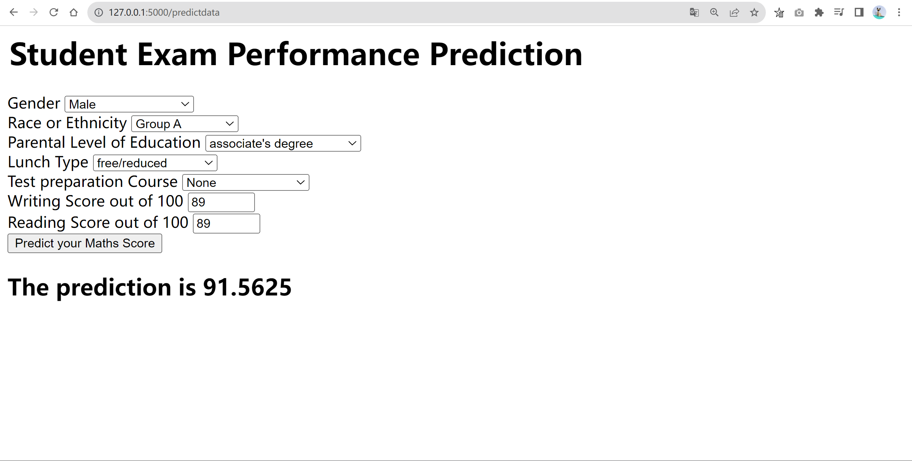
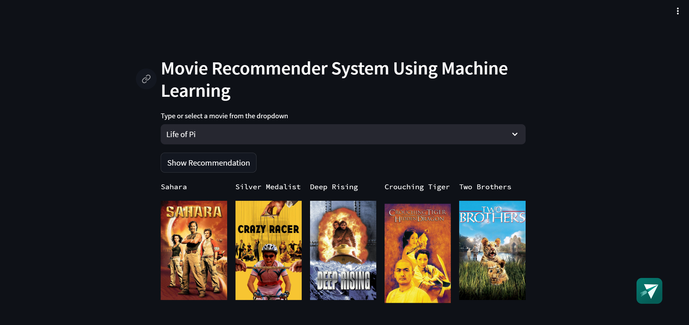
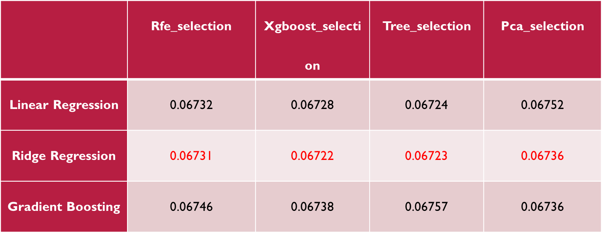

# Data Science Portfolio Repository

Welcome to the Data Science Portfolio repository! This repository showcases various data science projects and analyses that I have worked on, demonstrating my skills and expertise in the field of data science.

## Introduction

In this repository, you will find a collection of data science projects that cover a wide range of topics, including machine learning, deep learning, data analysis, big data & cloud and more. Each project is contained in its own directory with a dedicated README file that provides an overview of the project, the data sources used, methodologies applied, and the results obtained.

Data science is an ever-evolving field, and this portfolio aims to demonstrate my ability to tackle real-world problems, apply data-driven insights, and communicate findings effectively.

## Projects

- ### End to End project with Deployment
	 _Tools: AWS EC2, Docker, CI/CD, Flask, Streamlit, Heroku_
 
    - [Deploying ML models as Web Application on AWS EC2 Using Flask, Docker and CI/CD](https://github.com/zhaoshijie1248/E2E_mlproject_with_deployment):

		This project encompasses the development of a user-friendly web application for predicting student performance using various regression algorithms (Random Forest, Decision Tree, Gradient Boosting, Linear Regression, XGBRegressor, CatBoosting Regressor, AdaBoost Regressor). The deployment on AWS EC2, coupled with a CI/CD pipeline and Docker containers, ensures that the application is accessible, scalable, and maintainable, making it a valuable tool for educational institutions and stakeholders.

		
      
    - [Movie Recommendation Web Application](https://github.com/zhaoshijie1248/Movie-Recommend)
    
		Movie Magic Recommender is an end-to-end machine learning project that focuses on creating a user-friendly movie recommendation system using content-based filtering. This project leverages the power of Streamlit for creating an interactive and visually appealing user interface and deploys the application on Heroku for easy access.

		
      
 
      		
      	 

- ### Machine Learning
  _Tools: scikit-learn, Pandas, Seaborn, Matplotlib,_ 
	
    
	- [Zillow house price prediction](https://github.com/zhaoshijie1248/Capstone-zillow-prediction)

   		This project aims to improve Zillow's house price prediction model by addressing a serious missing data problem through K-Nearest Neighbors (KNN) imputation. The primary focus of this project revolves around comprehensive data cleaning, feature engineering, and the application of various feature selection techniques to reduce dimensionality and enhance the accuracy of the predictive model.

   		

	

- ### Natural Language Processing
  _Tools: NLTK, Scikit-learn, XGBoost, Flask, Plotly_

	 
    
   	 

- ### Computer Vision
  - [Cell Segmentation Using Yolo V8 With Deployment] ()
 
    
- ### Data Engineering
    - [NYC Taxi Bigquery](https://github.com/zhaoshijie1248/NYC-Taxi-Bigquery):
    - [Twitter Big Data Pipeline](https://github.com/zhaoshijie1248/Twitter-Big-Data-Pipeline):

    	_Tools: xxx_

- ### Data Analysis and Visualisation

    - [Forecasting USD/EUR Exchange Rate using Arima, GARCH, VAR and RNN models](https://github.com/zhaoshijie1248/Forecasting-USD-EUR-Exchange-Rate)
		
	_Tools: R, Python (Pandas, Numpy, Seaborn and Matplotlib)_

	
	

