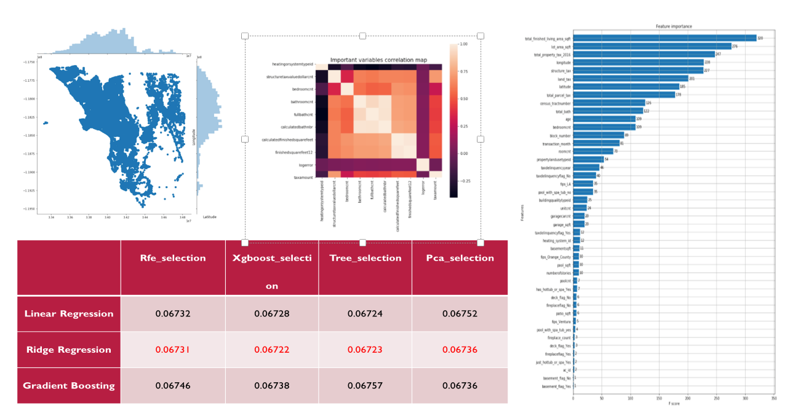

## Projects
- ### Natural Language Processing

  	- [Finetuning Large Language Models for Vulnerability Detection using QLora with single GPU](https://github.com/zhaoshijie1248/Finetuning-Large-Language-Models-for-Vulnerability-Detection)

   		We finetune WizardCoder, an LLM trained specifically on the ”language” of code in order to perform this binary classification. We use the QLoRA method in order to significantly cut down on the runtime and hardware requirements of finetuning the 13b parameter model. It turns out that quantizing the model led to reducing our memory footprint by a factor of 4(around 26gb for the full model, and only around 6gb whenit was quantized). We obtain a best ROC AUC of 0.72 and a best F1 Score of 0.66. Further, we perform experimentation on two hyperparameters, namely sequence length and the inclusion of large functions.

   		 
    
 		 _Tools: transformers, peft, bitsandbytes_

  	- [CryptoGPT: Crypto Twitter Sentiment Analysis](https://github.com/zhaoshijie1248/CryptoGPT-Crypto-Twitter-Sentiment-Analysis)

   		This project aims to provide a user-friendly web application to analyze the sentiment of posts from crypto-related Key Opinion Leaders (KOLs), helping users make informed decisions effectively. Leveraging prompt engineering, I created prompt templates for ChatGPT and utilized the LangChain API to automatically compute sentiment score. The application visualizes the data and trend line charts using Streamlit, offering an intuitive interface for easy interaction with the sentiment analysis tool. This ensures a seamless and effortless user experience, enabling users to engage with the sentiment analysis application efficiently.

   		 
    
 		 _Tools: GPT3.5, Langchain, tweety_

- ### Machine Learning
   - [Deploying ML models as Web Application on AWS EC2 Using Flask, Docker and CI/CD](https://github.com/zhaoshijie1248/Customer-Churn-Model-for-Music-Streaming-App-using-AWS-Sagemaker):
     		This project involved developing a churn prediction model for a music streaming application using AWS SageMaker. The pipeline encompassed data cleaning and preprocessing with SageMaker Data Wrangler, feature engineering, and model building with XGBoost. Hyperparameter tuning was conducted using SageMaker Automatic Tuning to optimize model performance. The final model was deployed via Batch Transform for batch predictions, with SageMaker Clarify integrated to provide model explainability. The solution utilized multiple AWS services, including S3 for data storage and SageMaker Studio for managing the full machine learning lifecycle.

     		

     _Tools: Python, AWS_
    
   - [Deploying ML models as Web Application on AWS EC2 Using Flask, Docker and CI/CD](https://github.com/zhaoshijie1248/E2E_mlproject_with_deployment):

		This project encompasses the development of a user-friendly web application for predicting student performance using various regression algorithms (Random Forest, Decision Tree, Gradient Boosting, Linear Regression, XGBRegressor, CatBoosting Regressor, AdaBoost Regressor). The deployment on AWS EC2, coupled with a CI/CD pipeline and Docker containers, ensures that the application is accessible, scalable, and maintainable, making it a valuable tool for educational institutions and stakeholders.

		
		

	 _Tools: Python, Flask, Docker, AWS ECR/EC2, CI/CD_

   - [Production-ready Machine Learning pipeline](https://github.com/zhaoshijie1248/ML_pipeline):

		This project aims to engineer a scalable, reproducible ML pipeline utilizing Poetry for dependency management, DVC for data and
 model versioning, FastAPI for serving model predictions through a REST API

		
                
                
  
	 _Tools: Poetry, DVC, FastAPI_
  
      
    - [Movie Recommendation Web Application](https://github.com/zhaoshijie1248/Movie-Recommend)
    
		Movie Magic Recommender is an end-to-end machine learning project that focuses on creating a user-friendly movie recommendation system using content-based filtering. This project leverages the power of Streamlit for creating an interactive and visually appealing user interface and deploys the application on Heroku for easy access.

		 

		_Tools: Python, Streamlit_

    
	- [Zillow house price prediction](https://github.com/zhaoshijie1248/Capstone-zillow-prediction)

   		This project aims to improve Zillow's house price prediction model by addressing a serious missing data problem through K-Nearest Neighbors (KNN) imputation. The primary focus of this project revolves around comprehensive data cleaning, feature engineering, and the application of various feature selection techniques to reduce dimensionality and enhance the accuracy of the predictive model.

   		 
     
   		_Tools: scikit-learn, Pandas, Seaborn, Matplotlib_

	

- ### Computer Vision
   	- [Object Detection on Monkey, Cat and Dog with YOLOv8](https://github.com/zhaoshijie1248/Object-Detection-with-YOLOv8/tree/005d72183927dfd47930860f8b167039ff60be17)

   		This is AI537 Computer Vision 1 HW3 mini-project. We have constructed several datasets that contain varying amounts of labeled/annotated cats in the training set. And we will be training models with these different amounts of annotated data and comparing the test performance of these models. 

   		 
    
 		 _Tools: YOLOv8_
    
- ### Data Engineering
    - [NYC Taxi Bigquery](https://github.com/zhaoshijie1248/NYC-Taxi-Bigquery):
 
		Processed a large-scale dataset of over a billion NYC taxi trips using Google BigQuery, optimizing analysis and
 training costs to under $20 while accurately predicting fare amounts.
                exchangerate.png
      
		_Tools: Python, SQL_
    

- ### Data Analysis and Visualisation

    - [Forecasting USD/EUR Exchange Rate using Arima, GARCH, VAR and RNN models](https://github.com/zhaoshijie1248/Forecasting-USD-EUR-Exchange-Rate)
		
	        _Tools: R, Python (Pandas, Numpy, Seaborn and Matplotlib)_

	
	

